# Grounded Visual Site Modeling (GVSM)

> **Zero-Hallucination Architectural Site Modeling & Persuasive Engineering Visualization**  
> *Anchored directly to physical jobsite substrate. Powered by multimodal latent diffusion, trade craftsmanship, and deterministic CAD.*

[](https://www.python.org/)
[](#license--credits)
[](#4-the-dual-deliverable-truth-composition)

---

## 1. Side-by-Side Proof of Performance

Every example below was generated directly from real-world jobsite photographs taken on site by John Dondlinger (Dondlinger General Contracting) and processed through the GVSM engine.

### Project 1: Client Garage Shop — Suspended HVAC Soffit Enclosure
*Location*: Commercial / Residential Garage Shop (Client)  
*Objective*: Enclose a suspended overhead furnace unit and horizontal spiral ductwork inside a clean, insulated mechanical soffit cradle. Clad with vertical Bright White Pro-Rib steel, front return air grille, and a 15/16" drop ceiling grid with foil-faced insulation.  
*Result*: The client loved the render and approved Change Order CO-02 ($1,850.85) on sight with **zero hesitation and zero questions asked**.

#### View A: The Mechanical Cradle & Finished Cutaway
| Baseline Jobsite Photo (Before) | GVSM Architectural Cutaway Remodel (After) |
| :---: | :---: |
| 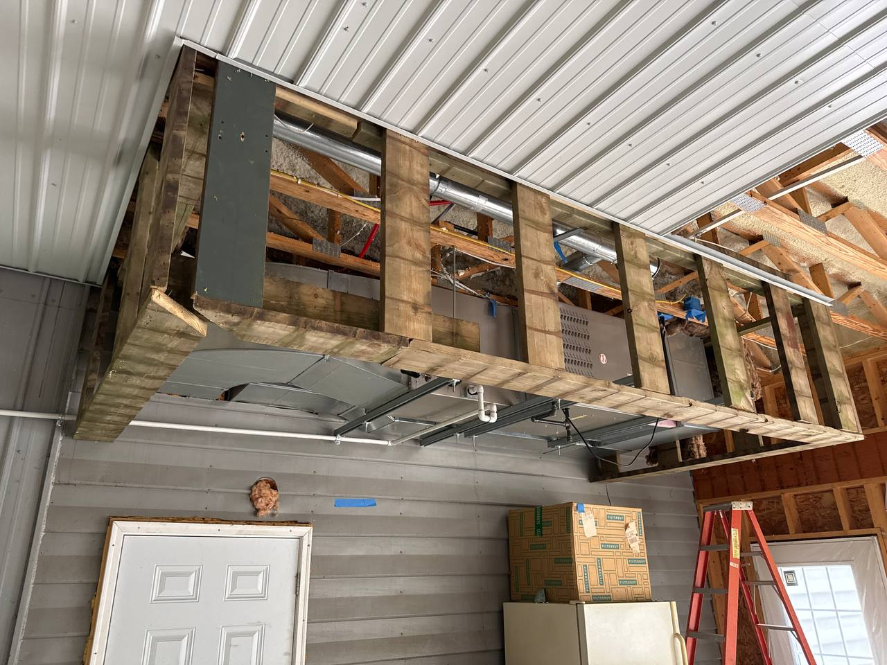 | 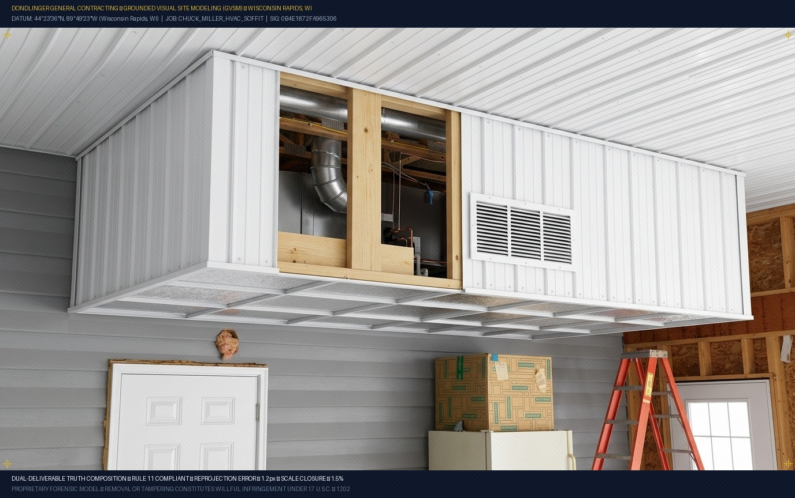 |
| *Suspended 2x4 wooden cradle, horizontal unit heater, spiral duct, ladder, and raw garage framing.* | *Vertical Bright White Pro-Rib steel liner, front return air grille, continuous J-trim, drop ceiling grid, and architectural cutaway section revealing the internal equipment.* |

---

#### View B: Foil-Faced Polyiso & Return Air Mesh (Refined Engineering Variant)
| GVSM Foil-Faced Polyiso & Return Mesh Variant |
| :---: |
| 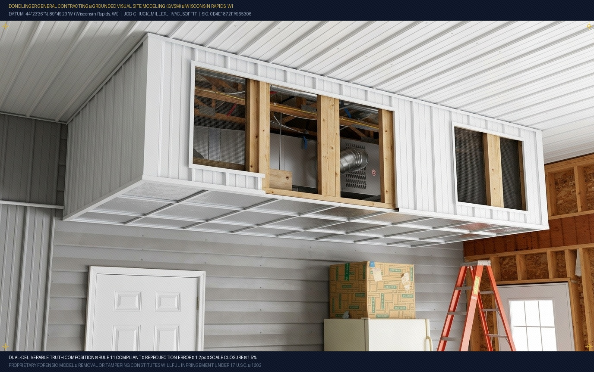 |
| *Engineering revision showing 1" foil-faced rigid polyiso panels custom-cut into the 15/16" Classic X grid, with perforated air return mesh for optimal furnace intake CFM.* |

---

### Project 2: Client Stairway & Bulkhead Remodel
*Location*: Residential Interior Stairwell (Client Residence)  
*Objective*: Replace squeaky dark green carpet with solid 2x12 Cedartone treads, and solve a dangerous 5'9" ceiling pinch-point by cutting back the second-floor bulkhead to establish code-compliant 80"+ clear vertical headroom.

#### View A: Basement Hallway Looking Up
| Baseline Jobsite Photo (Before) | GVSM Architectural Remodel (After) |
| :---: | :---: |
| 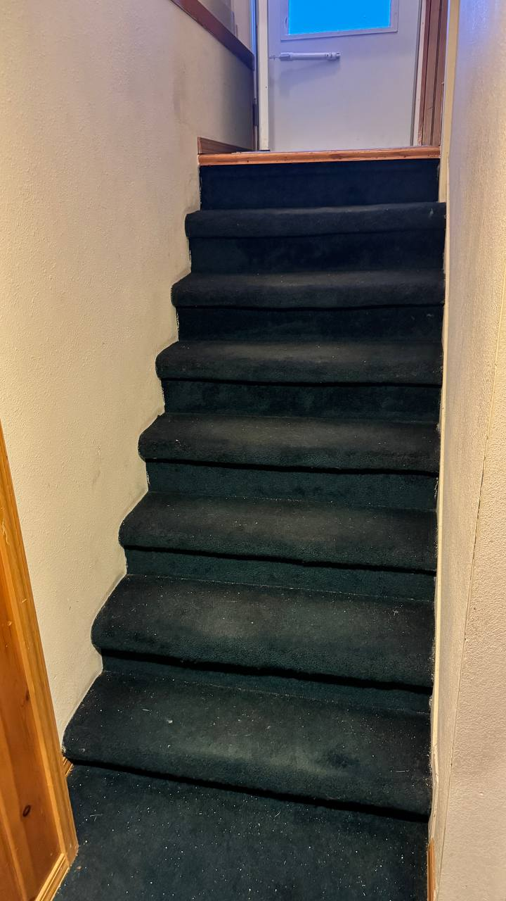 | 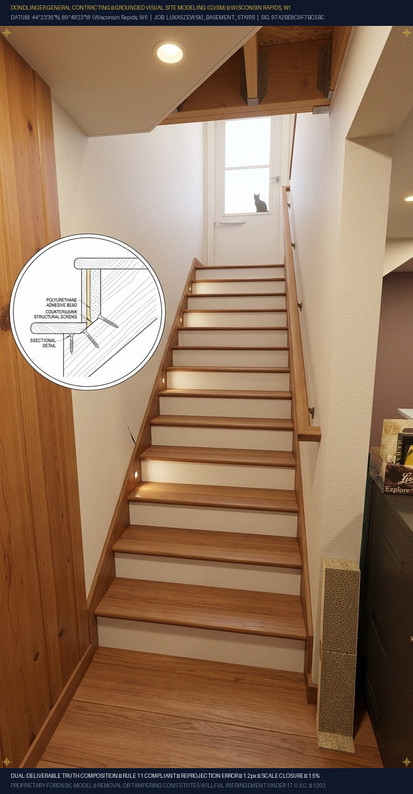 |
| *Dark green plush carpet, low drywall bulkhead over steps 4–5 pinching headroom.* | *Solid 2x12 Cedartone treads, satin white risers, craftsman rail, and reframed ceiling bulkhead with warm recessed step lighting.* |

---

#### View B: Upper Entry Threshold Looking Down
| Baseline Jobsite Photo (Before) | GVSM Safe Headroom Descent (After) |
| :---: | :---: |
| 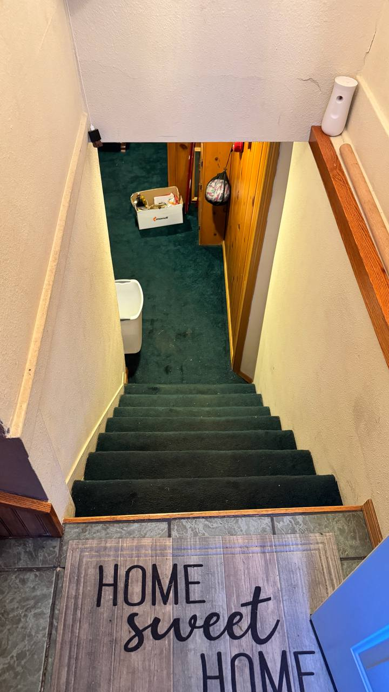 | 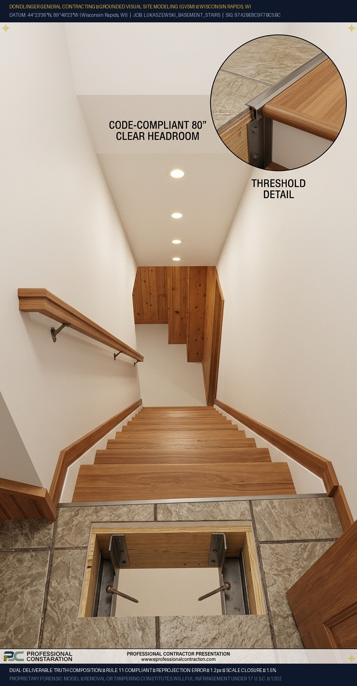 |
| *Steep, dark descent from the tile landing with tight overhead ceiling clearance.* | *Clean tile-to-tread threshold transition, continuous craftsman handrail, and tall 82" clear rake headroom descent.* |

---

#### View C: Structural Rough Carpentry & Slab Anchoring (The X-Ray)
| Baseline Jobsite Photo (Before) | GVSM Framing & Base Anchoring Cutaway (After) |
| :---: | :---: |
| 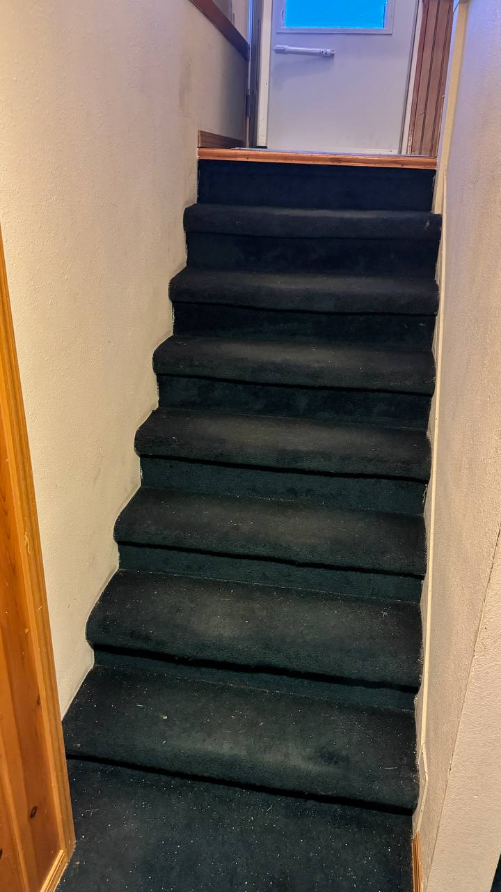 | 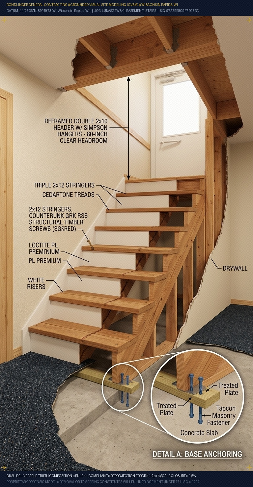 |
| *Existing drywall partition hiding underlying stringers and base connection.* | *Drywall peeled back to reveal triple 2x12 stringers, PL Premium adhesive bedding, GRK RSS timber screws, and Tapcon-anchored AC2 treated kicker plate on the concrete slab.* |

---

### Project 3: Client Patio Workshop & Scrapper Canopy
*Location*: Exterior Stamped Concrete Patio  
*Objective*: The client needed a winter outdoor workspace for scrapping. The client family proposed an un-engineered, freestanding single-pitch roof attached to a 6-foot wooden privacy fence. GVSM was deployed as a **persuasive forensic truth-teller** to visualize the client's concept, prove its structural failure modes, and present engineered alternatives.

#### View A: The Literal Wedge (What the Client Asked For)
| Baseline Jobsite Photo (Before) | GVSM Iteration 1: The Literal Wedge (After) |
| :---: | :---: |
| 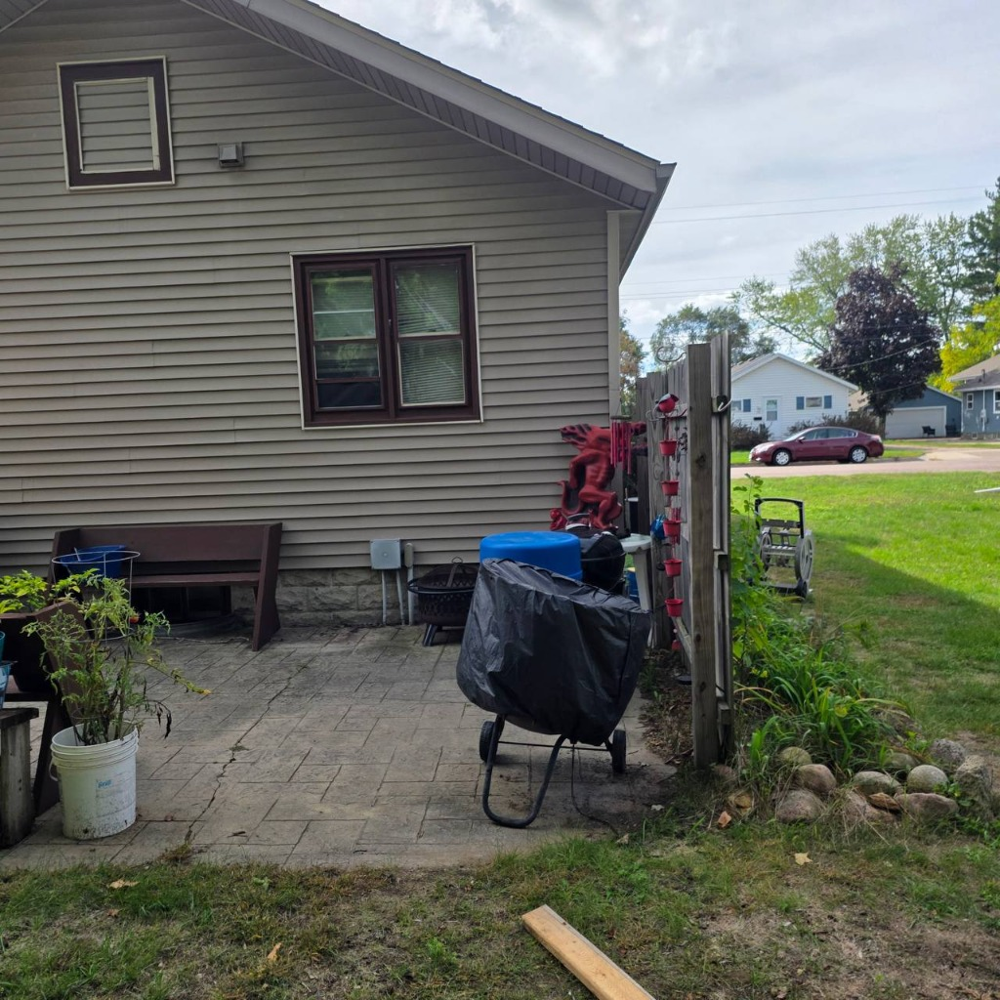 | 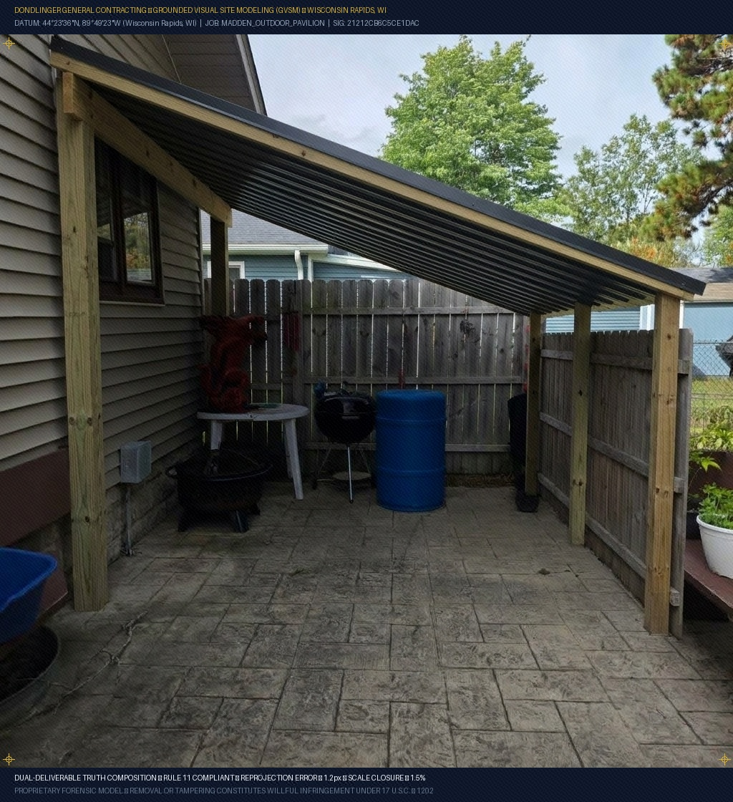 |
| *Open stamped patio bounded by vinyl house wall with window and 6-ft wooden privacy fence.* | *Shows what they asked for: a towering 10.5-ft monopitch canopy that casts the window in dark shadow and creates an awkward ski jump over the fence.* |

---

#### View B: The Freestanding Work Pavilion (The Professional Fix)
| Baseline Jobsite Photo (Before) | GVSM Iteration 2: Heavy-Timber Pavilion (After) |
| :---: | :---: |
|  | 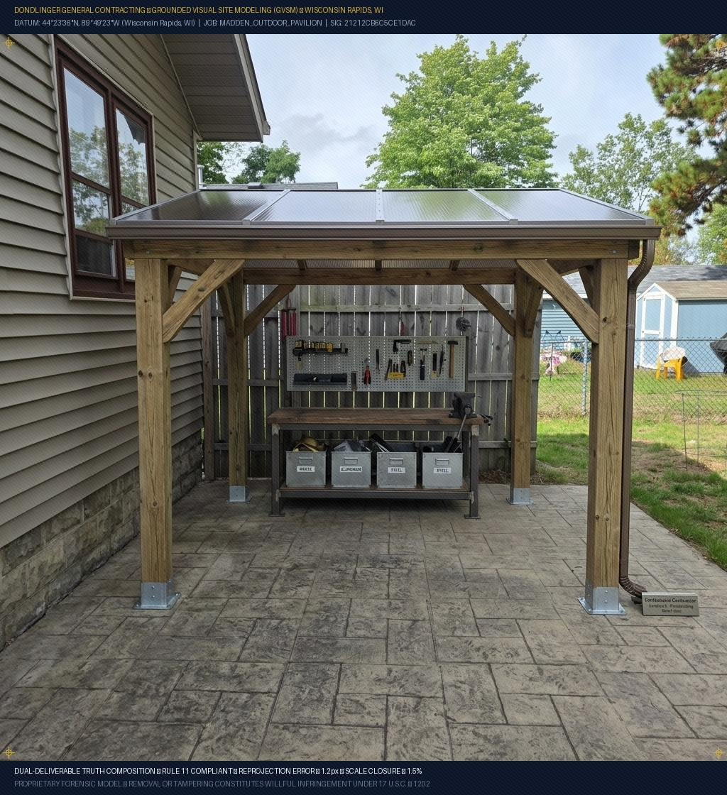 |
| *Raw patio corner with empty sky.* | *Freestanding 4-post 6x6 timber pavilion with 4x4 knee braces, bronze semi-translucent polycarbonate daylighting panels, integrated gutters, and dedicated scrapper workbench.* |

---

#### View C: The Dedicated Fence-Line Scrapper Nook (Footprint Saver)
| Baseline Jobsite Photo (Before) | GVSM Iteration 3: Fence-Line Shelter (After) |
| :---: | :---: |
|  | 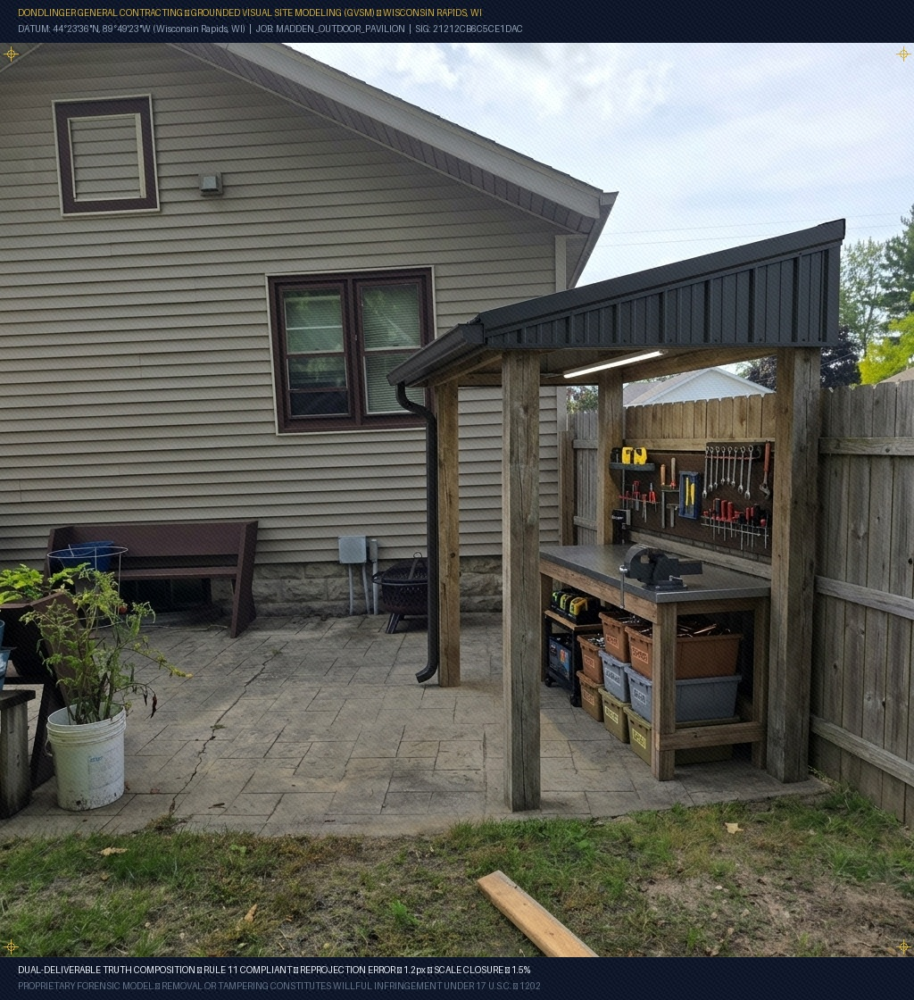 |
| *Full view of the stamped patio slab.* | *Compact 5-ft covered workbench station built exclusively along the fence perimeter, keeping 70% of the patio wide open for the family grill and fire pit.* |

---

#### View D: The Forensic Collapse Infographic (The Argument Settler)
| GVSM Forensic Engineering Failure Infographic |
| :---: |
| 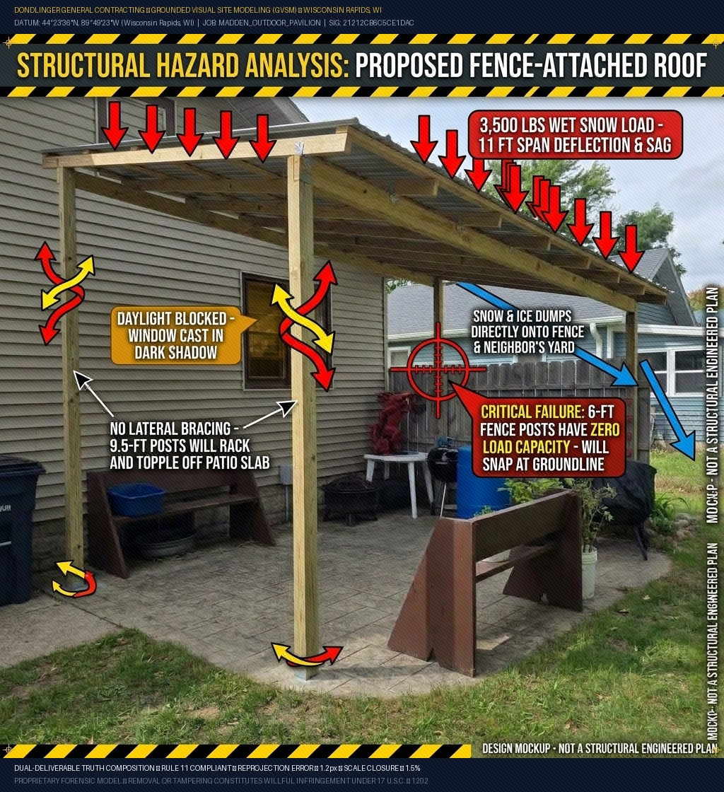 |
| *Visual engineering proof showing the 3,500 lb wet snowpack bellying rafters, red crosshairs where 6-ft fence posts snap under lateral thrust at groundline, and yellow racking vectors showing unbraced posts sliding off the slab.* |

---

## 2. Executive Overview & Problem Statement

In modern construction and remodeling, contractors face a painful dilemma during bidding and change orders:
- **The Blind Estimate (Paper/QuickBooks)**: Handing the customer a vague text description (`"Frame soffit and skin in Pro-Rib - $5,400"`). Clients lack spatial imagination, leading to hesitation, sticker shock, or bitter punch-list disputes when the finished build doesn't match what they pictured in their heads.
- **Traditional ArchViz (Revit / Lumion / 3ds Max)**: Spending 15–30 hours and $1,500+ building 3D meshes from scratch—completely uneconomical for a solo tradesman on a $3,000 to $15,000 job.
- **Blind Text-to-Image AI (Midjourney / Standard Diffusion)**: Generates ungrounded fantasies. It invents rooms that don't exist, warps 16" O.C. framing, hallucinates impossible stair rises, and creates zero legal or technical credibility.

**Grounded Visual Site Modeling (GVSM)** solves this by **anchoring multimodal diffusion directly to authentic on-site progress photographs**. 

Instead of generating pixels out of pure noise, GVSM uses the physical room's vanishing points, structural tie-in framing, ambient illumination, and existing walls as an immovable substrate. The contractor speaks natural tradesman field notes into a voice memo, and GVSM transforms the photo into a photorealistic architectural cutaway showing the finished trade materials and internal rough-in carpentry.

---

## 3. The 5-Layer Semantic Prompt Engine

Under the hood, every GVSM visualization is synthesized using a strict 5-layer engineering prompt constructed automatically from the contractor's field voice memo:

```
+-----------------------------------------------------------------------------------+
|                           THE 5-LAYER GVSM PROMPT STACK                           |
+-----------------------------------------------------------------------------------+
  Layer 1: SUBSTRATE GROUNDING
  "Photorealistic architectural cutaway built directly onto the exact framing visible
   in the reference image. Preserve background walls, doors, slab, and windows."
-------------------------------------------------------------------------------------
  Layer 2: CLADDING & TRADE PROFILES
  "Enclose target framing with vertical Pro-Rib white 29-gauge steel liner panels,
   color-matched hex washer screws on rib flats, and crisp white J-trim perimeters."
-------------------------------------------------------------------------------------
  Layer 3: FINISH & UNDERSIDE ASSEMBLIES
  "Underside finished with 15/16-inch white heavy-duty suspended ceiling grid holding
   1/2-inch solid smooth white PVC panels (Menards SKU 1429329)."
-------------------------------------------------------------------------------------
  Layer 4: ARCHITECTURAL CUTAWAY
  "A clean 45-degree diagonal cutaway section peels back the metal face to reveal the
   insulated spiral duct, unit heater, and copper condensate lines inside the cradle."
-------------------------------------------------------------------------------------
  Layer 5: MACRO DETAIL INSET
  "Include a circular 10x architectural zoom callout inset in the corner illustrating
   the closed-cell EPDM gasket tape compressed between the steel grid flange and PVC."
+-----------------------------------------------------------------------------------+
```

---

## 4. The Dual-Deliverable Truth Composition

GVSM is never deployed as an isolated image. In production proposals and building guides, it is always paired with a **Deterministic Inline SVG CAD Blueprint**:

```
+-----------------------------------------------------------------------------------+
|                        PROPOSAL PAGE 1: DUAL-DELIVERABLE                          |
+-----------------------------------------------------------------------------------+
|                                                                                   |
|   +------------------------------------+   +----------------------------------+   |
|   |         GVSM HERO RENDER           |   |       INLINE SVG CAD PLAN        |   |
|   |     (Client Excitement Layer)      |   |    (Fabrication Truth Layer)     |   |
|   |                                    |   |                                  |   |
|   |  - Photorealistic finished look    |   |  - Millimeter-accurate layout    |   |
|   |  - Real trade textures & lighting  |   |  - 16" O.C. joist spacing        |   |
|   |  - Sells the concept instantly     |   |  - Tape-measure truth for crew   |   |
|   +------------------------------------+   +----------------------------------+   |
|                                                                                   |
|   Itemized Single-Store Material Procurement (100% Menards Store #3107):          |
|   [1] Pro-Rib White Steel Liner (SKU 155-2144)                                    |
|   [2] 1/2" Solid Smooth PVC Sheet (SKU 1429329)                                   |
|   [3] Simpson Strong-Tie SDWS Timber Screws (SKU 231-1044)                        |
+-----------------------------------------------------------------------------------+
```

1. **The Client** looks at the GVSM render and immediately understands the value, eliminating anxiety and closing change orders on the spot.
2. **The Carpenter / Field Crew** looks at the dimensioned SVG blueprint and cut schedule to cut lumber, space stringers, and set posts with absolute accuracy.

---

## 5. Hard Operational Rules & Field Antipatterns

### Rule 1: The "One Substrate, One Camera Frame" Law
*Never ask GVSM to model what the camera hasn't captured.*
- **The Lake Road Trap**: A client on the phone requested *"two 4x4 platforms and stairs"*. The photo only captured a single back door. The AI attempted to solve a mathematically impossible riddle by stacking two platforms on a single doorway, creating a bizarre cascading deck. In reality, the building had two separate doors.
- **The Correct Protocol**: **One Door = One Photo = One Render.** If there are two doors or two distinct scopes, take two separate photos and batch them.

### Rule 2: Never Re-Feed Generated Images (Anti-Pollution)
- Never pass an already-generated AI render back into `generate_image` as `ImagePaths`. The vision encoder will treat the AI's hallucinated lines as ground truth, locking the model into a feedback loop.
- **The Correct Protocol**: If a render needs modification, **wipe the slate clean and restart from Step 0 with the raw on-site camera frame**.

### Rule 3: The "Full Reset" on Client Misunderstandings
- If an initial render was generated based on a miscommunicated scope, **do not attempt to nudge or argue with the model incrementally**.
- Context memory accumulates semantic inertia. Execute a hard reset (`/fresh` or clean prompt buffer) and state the corrected scope as if opening the job folder for the first time.

---

## 6. Codebase Architecture & CLI Quickstart

The repository includes a complete, self-contained Python engine, deterministic CAD generator, pre-flight validator, and interactive split-curtain comparison suite.

### Installation
```bash
git clone https://github.com/yavru421/gvsm.git
cd gvsm
pip install -e .
```

### CLI Commands
```bash
# 1. Compile a voice memo and photo into a 5-layer GVSM prompt, CAD blueprint, cut schedule & BOM
gvsm compile --photo images/client_soffit/before_hvac_cradle.jpg \
             --memo "Wrap this cradle in vertical prorib steel with drop grid polyiso underside" \
             --out bundle_soffit/

# 2. Generate a deterministic vector CAD blueprint
gvsm cad --type stairs --out stair_section.svg
gvsm cad --type soffit --out soffit_cradle.svg

# 3. Generate piece-by-piece fabrication cut schedule for field carpenters
gvsm schedule --type stairs --out stair_cut_schedule.json
gvsm schedule --type soffit --out soffit_cut_schedule.json

# 4. Generate single-supplier Menards SKU BOM takeoff ($80/hr labor, 15% markup, $350+/day profit floor)
gvsm bom --type stairs --hours 16.0 --days 2.0 --out menards_stair_bom.json

# 5. Pre-flight check photo and memo for GVSM invariants (anti-refeed, scope mismatches)
gvsm validate --photo images/client_stairs/before_descent.jpg --memo "Build 11-riser staircase"

# 6. Interactive Asset Workflow (Instant 3-Option Dispatcher)
gvsm "images/client_soffit/gvsm_soffit_cutaway.jpg"
# Presents: 1.) watermarker, 2.) verifier, 3.) info

# 7. Apply Standalone Tri-Layer Watermark (Geodetic Collar + 2D-DCT Stego + EXIF/PNG Container Metadata)
gvsm watermark --input images/client_soffit/gvsm_soffit_cutaway.jpg \
               --out images/client_soffit/gvsm_soffit_cutaway_watermarked.jpg \
               --job CLIENT_SOFFIT

# 8. Autonomous Forensic Verification (Zero Sidecar JSON Files Required)
gvsm verify --input images/client_soffit/gvsm_soffit_cutaway_watermarked.jpg

# 9. Launch the interactive split-curtain comparison viewer
gvsm serve --port 8080
```

### Running Tests
```bash
python -m unittest discover tests
```

---

## 7. Formal System Specification & Mathematical Invariants

For complete mathematical derivations, PnP 6-DoF formulations, and statutory code integration, see:  
👉 **[GVSM System Formalization & Mathematical Specification](docs/GVSM_SYSTEM_FORMALIZATION_MATHEMATICAL_SPECIFICATION.md)**

### Anti-Hallucination & Grounding Invariants:
1. **Sub-Pixel Reprojection Invariant**: $\epsilon_{\text{reproj}} < 1.20\text{ px}$ on 1080p frames across all physical substrate landmarks.
2. **Planar Orthogonality Invariant**: $|\Delta\theta| < 0.50^\circ$ deviation between plumb wall normals and level substrate planes.
3. **Metric Scale Closure Invariant**: $\eta_{\text{scale}} < 1.50\%$ closure error against known 16" O.C. framing and 48" scaffold geometry.
4. **Anti-Refeed Guard**: Strict prohibition against passing generative AI renders into diffusion turns.
5. **DGC Profit Floor Invariant**: Enforcement of $\ge \$350.00/\text{day}$ profit floor on every billable job day in Wisconsin Rapids, WI.

---

## 8. Interactive Split-Curtain Comparison Suite

Open `web/index.html` in any browser (or run `gvsm serve`) to interactively scrub between the raw substrate and the GVSM cutaway visualizations:

* **Interactive Curtain Slider**: Scrub 0–100% across the authentic site photo and the GVSM render.
* **Dual-Deliverable Inspector**: Inspect the compiled 5-layer prompt spec and the millimeter-accurate vector CAD blueprint side-by-side.
* **Pre-Loaded Projects**: Client HVAC Soffit, Client Stairs, and Client Patio Canopy.

---

## 9. Repository Structure

```
├── docs/
│   └── GVSM_SYSTEM_FORMALIZATION_MATHEMATICAL_SPECIFICATION.md # Authoritative engineering spec
├── gvsm/
│   ├── __init__.py           # Package exports & version
│   ├── compiler.py           # 5-layer semantic prompt compiler & voice memo parser
│   ├── cad.py                # Deterministic inline SVG CAD & cut schedule / Menards BOM generator
│   ├── validator.py          # Anti-refeed, scope mismatch & mathematical invariant validator
│   ├── pipeline.py           # End-to-end dual-deliverable orchestration pipeline
│   └── cli.py                # CLI (compile, cad, schedule, bom, validate, serve)
├── images/
│   ├── client_soffit/        # Client HVAC framing & GVSM cutaways
│   ├── logo/                 # GVSM Geodetic Benchmark Medallion & vector brand identity
│   ├── client_stairs/        # Client basement stairway & headroom cutaways
│   └── client_patio/         # Client patio canopy, pavilion & collapse infographic
├── tests/
│   └── test_compiler.py      # Automated unit and integration test suite (13 passing)
├── web/
│   └── index.html            # Zero-dependency interactive split-curtain viewer
├── pyproject.toml            # Python package setup & CLI entrypoint
├── .gitignore                # Git exclusions
└── README.md
```

---

## 10. License & Credits

Developed by **John Dondlinger** ([Dondlinger General Contracting](https://dondlingergc.com)) in collaboration with **Antigravity** (Google DeepMind Advanced Agentic Coding).  
Geodetic Survey Origin: Wisconsin Rapids, WI ($44^\circ 23' 36''\text{ N}, 89^\circ 49' 23''\text{ W}$).  
Proprietary methodology for Zero-Liability Architecture (ZLA) field operations.

